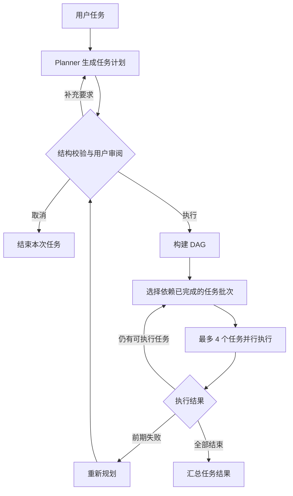

# CodeMate

CodeMate 是一个基于 Java 17 的终端 AI 编程助手，通过自然语言驱动代码阅读、文件修改、命令执行和项目创建。

当前版本：**v0.10.0 — 联网能力与 Web 工具**。

## 当前能力

- **ReAct 模式**：模型选择工具，程序执行并回传结果，模型继续判断下一步。
- **Plan-and-Execute 模式**：先生成完整计划，再按任务依赖逐批执行。
- **DAG 调度**：使用有向无环图表示任务依赖，同一批最多并行执行 4 个互不依赖的任务。
- **计划审阅**：执行前可确认、展开完整计划、取消，或补充要求后重新规划。
- **失败处理**：任务失败且计划进度不足一半时尝试重新规划；依赖失败任务的节点不会被错误执行。
- **基础工具**：读取文件、写入文件、列出目录、执行 Shell 命令、创建项目骨架。
- **会话历史**：保留用户消息、模型回复与工具结果，支持手动清空。
- **分层 Memory**：短期记忆保存会话与工具结果，长期记忆持久化可跨会话复用的事实。
- **上下文压缩**：根据 Token 预算触发旧记忆的 Map-Reduce 摘要，并保留近期原始消息。
- **相关记忆召回**：结合关键词匹配、时间衰减和类型权重，将 Top-K 结果按 Token 限额注入提示词。
- **事实管理**：通过 `/save` 显式保存适合跨会话复用的事实，通过 `/memory clear` 清空长期记忆。
- **代码库索引**：扫描常见代码与配置文件，按文件、Java 类和方法粒度生成代码块。
- **向量存储**：通过 Ollama 或 OpenAI 兼容接口生成 Embedding，并持久化到 SQLite。
- **混合检索**：融合余弦语义检索与关键词匹配，对类、方法及双通道命中结果加权。
- **代码关系图**：使用 JavaParser 分析 imports、extends、implements、calls 和 contains 关系。
- **Agent 检索工具**：将 `search_code` 注册为工具，让 ReAct 和 Plan 在需要时查询代码库。
- **流式模型响应**：使用 SSE 增量解析模型返回的思考内容、回复文本、工具参数片段和 Token 用量。
- **终端内容渲染**：将标题、列表、引用、表格和代码块等常见 Markdown 转换成适合终端阅读的样式。
- **运行日志**：使用 Logback 将执行信息写入文件，支持按日期和大小滚动、压缩及容量清理。
- **角色化协作**：Planner 负责拆解目标，Worker 调用工具执行，Reviewer 检查结果并提出反馈。
- **编排与并行**：Orchestrator 根据步骤依赖调度任务，默认使用 2 个 Worker 并行处理同批独立步骤。
- **审查反馈闭环**：Reviewer 不通过时，将问题和建议交回 Worker，每个步骤最多重试 2 次。
- **HITL 人工审批**：可在 `write_file`、`execute_command`、`create_project` 执行前展示风险和参数并等待确认。
- **会话级审批策略**：支持批准本次、同类操作全部放行、拒绝、跳过和修改 JSON 参数；无法识别的输入采用保守拒绝策略。
- **并行工具调用**：同一轮模型返回的多个独立工具调用由固定线程池并行执行，默认最多 4 个并发。
- **有序结果回灌**：并发任务完成后仍按原始 `tool_call` 顺序写回消息历史，避免破坏模型工具调用协议。
- **批次超时**：工具批次具有统一超时兜底，超时任务会被取消并转换为可供模型继续判断的工具结果。
- **统一模型接口**：通过 `LlmClient` 隔离对话、流式输出、工具定义和 Token 统计，上层 Agent 不再依赖具体厂商客户端。
- **双模型 Provider**：内置 GLM 和 DeepSeek 客户端，共用 OpenAI 兼容请求与 SSE 解析基类。
- **运行时切换**：使用 `/model glm` 或 `/model deepseek` 切换当前模型，同时保留已有对话、Memory 和工具状态。
- **上下文状态**：通过 `/context` 查看消息角色数量、对话轮次、字符量和 Memory Token 状态。
- **联网搜索**：`web_search` 支持智谱 Web Search、SerpAPI 和自托管 SearXNG，并按现有配置自动选择 Provider。
- **网页抓取**：`web_fetch` 使用 OkHttp 获取页面、Jsoup 解析 HTML，并通过简化 readability 提取 Markdown 正文。
- **网络访问围栏**：仅允许 HTTP/HTTPS，拒绝 localhost、loopback、link-local 和 site-local 地址，并限制请求频率、响应大小和总超时。
- **Agent 运行预算**：ReAct 和 SubAgent 通过 Token 预算、重复工具调用检测和硬轮数上限防止异常循环。

## 快速开始

需要 Java 17+、Maven，以及至少一个 GLM 或 DeepSeek API Key。Shell 工具依赖 `bash`；Windows 会优先查找常见位置的 Git Bash，也可以通过 `-Dcodemate.shell.bash=<路径>` 显式指定。

```powershell
Copy-Item .env.example .env
# 编辑 .env，填写 GLM_API_KEY
mvn clean package
java -jar target/codemate-0.10.0.jar
```

模型配置从 `~/.codemate/config.json`、环境变量和 `.env` 读取。至少配置 `GLM_API_KEY` 或 `DEEPSEEK_API_KEY`；模型名可分别通过 `GLM_MODEL` 和 `DEEPSEEK_MODEL` 指定。`.env` 已加入 Git 忽略规则。

Web 搜索默认优先复用 `GLM_API_KEY` 选择智谱，也可以通过 `SEARCH_PROVIDER` 显式选择 `zhipu`、`serpapi` 或 `searxng`。对应配置示例见 `.env.example`。

## 使用方式

默认输入使用 ReAct：

```text
读取 pom.xml 并说明项目依赖
```

直接使用计划模式：

```text
/plan 分析项目结构，修改实现并验证结果
```

也可以先输入 `/plan`，让下一条任务使用计划模式。计划生成后：

| 按键 | 行为 |
| --- | --- |
| `Enter` | 执行当前计划 |
| `Ctrl+O` | 展开完整计划 |
| `Esc` | 折叠完整计划，或取消本次计划 |
| `I` | 输入补充要求并重新规划 |

记忆与会话命令：

| 命令 | 行为 |
| --- | --- |
| `/model` | 查看当前模型和可用 Provider |
| `/model glm` / `/model deepseek` | 切换模型并保存默认 Provider |
| `/context` / `/ctx` | 查看当前对话上下文与 Memory 状态 |
| `/memory` / `/mem` | 查看短期、长期记忆及 Token 使用状态 |
| `/memory clear` | 清空长期记忆 |
| `/save <事实>` | 将指定事实写入长期记忆 |
| `/team` | 让下一条任务使用 Multi-Agent 协作模式 |
| `/team <任务>` | 直接使用 Multi-Agent 执行任务 |
| `/hitl` | 查看 HITL 审批状态 |
| `/hitl on` / `/hitl off` | 启用或关闭危险操作审批 |
| `/clear` | 清空短期对话历史和本次会话的“全部放行”记录，保留长期记忆 |
| `/index [路径]` | 为指定路径建立或重建代码索引，默认当前目录 |
| `/search <查询>` | 使用自然语言混合检索代码 |
| `/graph <类名>` | 查看类或方法的代码关系 |
| `/exit` / `/quit` | 退出程序 |

## 执行流程



Plan 中的每个任务仍然可以多轮调用工具，单任务最多执行 5 轮。计划只负责组织任务，实际文件和命令操作仍由统一工具注册表执行。

Multi-Agent 模式由编排器统一维护步骤状态：Planner 输出 JSON 计划，Worker 执行当前依赖已满足的步骤，Reviewer 审查每一步结果。并行步骤先写入独立缓冲区，再按步骤顺序输出，避免多个 Agent 的终端内容交错。

HITL 默认关闭。启用后，统一工具注册表会在危险工具执行前透明拦截；ReAct、Plan 和 Multi-Agent 共用同一个审批注册表，因此三条执行路径遵循一致规则。审批输入支持 `y/Enter`、`a`、`n`、`s`、`m`，其中修改后的参数会先经过 JSON 语法校验。

ReAct、Plan 的单任务执行器和 Multi-Agent Worker 都通过 `ToolRegistry.executeTools()` 执行一轮工具请求。模型必须把有依赖关系的操作拆到不同轮次；同一轮只适合读取多个文件、列出多个目录等互不依赖的操作。HITL 审批仍会串行读取终端输入，避免多个并发工具同时争抢 stdin/stdout。

切换模型时，主 ReAct Agent 会替换 `LlmClient`，MemoryManager 同步使用新客户端；之后新建的 Plan 和 Multi-Agent 执行器也会使用当前模型。默认 Provider 会写入 `~/.codemate/config.json`，API Key 仍建议放在环境变量或 `.env` 中。

Agent 面对最新版本、官方动态等时效性问题时可先调用 `web_search`，拿到 URL 后再通过 `web_fetch` 获取正文。已有 URL 时可以直接抓取；遇到 SPA 或防爬页面返回空正文后不会自动无限重试。

## 代码结构

```text
src/main/java/com/codemate/
├── cli/                  终端入口、命令解析、计划审阅输入
├── config/               Provider、模型与本地默认配置
├── agent/
│   ├── Agent.java        ReAct 执行循环
│   ├── PlanExecuteAgent.java
│   ├── AgentOrchestrator.java
│   ├── SubAgent.java
│   └── AgentRole.java / AgentMessage.java
├── plan/                 Planner、任务模型与 DAG 执行计划
├── memory/               短期/长期记忆、检索、预算与摘要压缩
├── rag/                  分块、AST 分析、Embedding、SQLite 与检索
├── hitl/                 风险分级、审批请求、终端交互与工具拦截
├── web/                  搜索 Provider、网络策略、网页抓取和正文提取
├── util/                 ANSI 样式、Jieba 工厂与终端 Markdown 渲染
├── llm/                  统一接口、兼容基类、GLM 与 DeepSeek 客户端
└── tool/ToolRegistry.java
```

长期记忆默认保存在 `~/.codemate/memory/long_term_memory.json`，可以通过 JVM 属性 `-Dcodemate.memory.dir=<目录>` 修改位置。

代码索引默认保存在 `~/.codemate/rag/codebase.db`，可以通过 JVM 属性 `-Dcodemate.rag.dir=<目录>` 修改位置。Embedding 默认使用 `ollama`、`nomic-embed-text:latest` 和 `http://localhost:11434`，也可以通过 `.env.example` 中的配置切换远程兼容接口。

日志默认写入 `~/.codemate/logs/codemate.log`。日志级别、目录、保留天数、单文件大小和总容量可以通过 `CODEMATE_LOG_*` 环境变量或对应的 `codemate.log.*` JVM 属性调整。

技术栈：Java 17、Maven、JLine、Jackson、OkHttp + SSE、Jieba、JavaParser、SQLite、Ollama、Logback、JUnit 5。

## 当前边界

- ReAct 与 Plan 由用户选择，尚未实现按任务复杂度自动路由。
- 重规划只在执行异常且当前进度不足 50% 时触发，不是每一步之后都进行全局判断。
- 当前只内置 GLM 和 DeepSeek；Provider 的 `baseUrl` 配置字段尚未用于覆盖客户端固定地址。
- 切换模型会保留对话上下文，不会自动重算或迁移不同模型之间的上下文限制。
- 工具并行上限和批次超时仍是代码内默认值，尚未提供 CLI 配置。
- `web_fetch` 只处理直接 HTTP 可获得的静态或服务端渲染 HTML，不执行 JavaScript，也不能绕过登录和反爬机制。
- 网络围栏属于基础 SSRF 防护，尚未解决 DNS rebinding 等完整生产级威胁。
- AgentBudget 默认是 300,000 Token、连续 3 轮相同工具调用和最多 50 轮，可通过 `codemate.react.*` JVM 属性覆盖。
- 流式输出依赖上游返回 OpenAI 兼容的 SSE 数据和 `reasoning_content` 字段；接口不返回推理内容时只展示回复。
- Planner、Worker 和 Reviewer 当前共享同一个模型客户端，通过系统提示词、工具权限和独立历史区分角色。
- Reviewer 属于模型判断，不等同于编译和测试等确定性验收；达到重试上限后会保留当前结果并继续汇总。
- Memory 有独立的容量和压缩机制，Agent 实际请求消息历史尚未进行统一裁剪。
- 长期记忆目前支持显式保存和整体清空，尚不支持单条编辑或删除。
- 建索引需要可用的 Embedding 服务；索引过程逐文件执行，大型仓库尚未做增量更新和批量向量化。
- Java 关系分析基于语法结构和名称匹配，不进行完整的类型与符号求解。
- HITL 默认关闭，开启后只负责交互确认；当前没有进程隔离或完整命令策略，不能把审批等同于沙箱。
- 尚未实现 MCP。

## 版本记录

完整演进记录和验证结果见 [CHANGELOG.md](CHANGELOG.md)。
