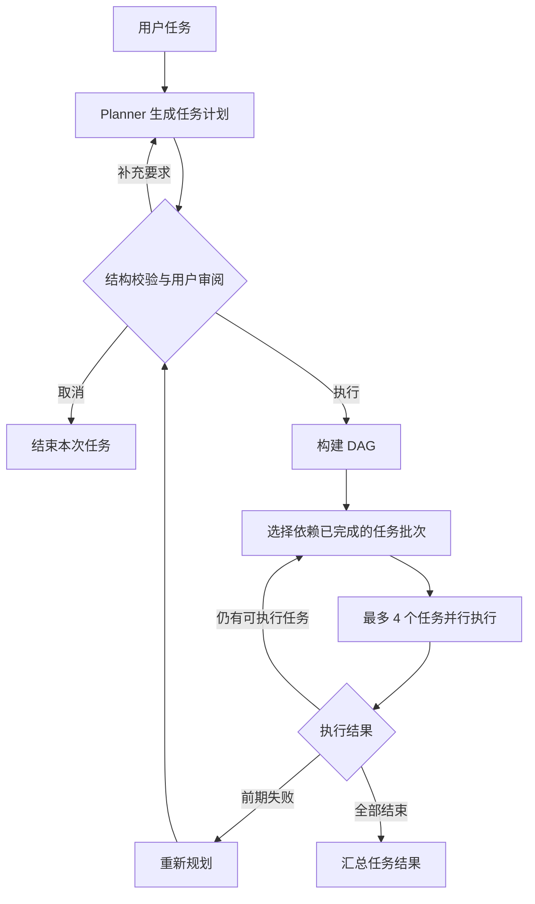

# CodeMate

CodeMate 是一个基于 Java 17 的终端 AI 编程助手，通过自然语言驱动代码阅读、文件修改、命令执行和项目创建。

当前版本：**v0.4.0 — RAG 代码库索引与检索**。

## 当前能力

- **ReAct 模式**：模型选择工具，程序执行并回传结果，模型继续判断下一步。
- **Plan-and-Execute 模式**：先生成完整计划，再按任务依赖逐批执行。
- **DAG 调度**：使用有向无环图表示任务依赖，同一批最多并行执行 4 个互不依赖的任务。
- **计划审阅**：执行前可确认、展开完整计划、取消，或补充要求后重新规划。
- **失败处理**：任务失败且计划进度不足一半时尝试重新规划；依赖失败任务的节点不会被错误执行。
- **基础工具**：读取文件、写入文件、列出目录、执行 Shell 命令、创建项目骨架。
- **会话历史**：保留用户消息、模型回复与工具结果，支持手动清空。
- **分层 Memory**：短期记忆保存会话与工具结果，长期记忆持久化可跨会话复用的事实。
- **上下文压缩**：根据 Token 预算触发旧记忆的 Map-Reduce 摘要，并保留近期原始消息。
- **相关记忆召回**：结合关键词匹配、时间衰减和类型权重，将 Top-K 结果按 Token 限额注入提示词。
- **事实管理**：支持自动提取对话事实，也可以通过 `/save` 显式保存。
- **代码库索引**：扫描常见代码与配置文件，按文件、Java 类和方法粒度生成代码块。
- **向量存储**：通过 Ollama 或 OpenAI 兼容接口生成 Embedding，并持久化到 SQLite。
- **混合检索**：融合余弦语义检索与关键词匹配，对类、方法及双通道命中结果加权。
- **代码关系图**：使用 JavaParser 分析 imports、extends、implements、calls 和 contains 关系。
- **Agent 检索工具**：将 `search_code` 注册为工具，让 ReAct 和 Plan 在需要时查询代码库。

## 快速开始

需要 Java 17+、Maven 和 GLM API Key。Shell 工具依赖 PATH 中可用的 `bash`，Windows 可以使用 Git Bash 环境。

```powershell
Copy-Item .env.example .env
# 编辑 .env，填写 GLM_API_KEY
mvn clean package
java -jar target/codemate-0.4.0.jar
```

API Key 的读取顺序为：当前目录 `.env`、用户主目录 `.env`、环境变量 `GLM_API_KEY`。`.env` 已加入 Git 忽略规则。

## 使用方式

默认输入使用 ReAct：

```text
读取 pom.xml 并说明项目依赖
```

直接使用计划模式：

```text
/plan 分析项目结构，修改实现并验证结果
```

也可以先输入 `/plan`，让下一条任务使用计划模式。计划生成后：

| 按键 | 行为 |
| --- | --- |
| `Enter` | 执行当前计划 |
| `Ctrl+O` | 展开完整计划 |
| `Esc` | 折叠完整计划，或取消本次计划 |
| `I` | 输入补充要求并重新规划 |

记忆与会话命令：

| 命令 | 行为 |
| --- | --- |
| `/memory` / `/mem` | 查看短期、长期记忆及 Token 使用状态 |
| `/save <事实>` | 将指定事实写入长期记忆 |
| `/clear` | 提取当前会话中的关键事实，然后清空短期历史 |
| `/index [路径]` | 为指定路径建立或重建代码索引，默认当前目录 |
| `/search <查询>` | 使用自然语言混合检索代码 |
| `/graph <类名>` | 查看类或方法的代码关系 |
| `/exit` / `/quit` | 退出程序 |

## 执行流程



Plan 中的每个任务仍然可以多轮调用工具，单任务最多执行 5 轮。计划只负责组织任务，实际文件和命令操作仍由统一工具注册表执行。

## 代码结构

```text
src/main/java/com/codemate/
├── cli/                  终端入口、命令解析、计划审阅输入
├── agent/
│   ├── Agent.java        ReAct 执行循环
│   └── PlanExecuteAgent.java
├── plan/                 Planner、任务模型与 DAG 执行计划
├── memory/               短期/长期记忆、检索、预算与摘要压缩
├── rag/                  分块、AST 分析、Embedding、SQLite 与检索
├── llm/GLMClient.java    模型请求和响应解析
└── tool/ToolRegistry.java
```

长期记忆默认保存在 `~/.codemate/memory/long_term_memory.json`，可以通过 JVM 属性 `-Dcodemate.memory.dir=<目录>` 修改位置。

代码索引默认保存在 `~/.codemate/rag/codebase.db`，可以通过 JVM 属性 `-Dcodemate.rag.dir=<目录>` 修改位置。Embedding 默认使用 `ollama`、`nomic-embed-text:latest` 和 `http://localhost:11434`，也可以通过 `.env.example` 中的配置切换远程兼容接口。

技术栈：Java 17、Maven、JLine、Jackson、OkHttp、Jieba、JavaParser、SQLite、Ollama、JUnit 5、SLF4J。

## 当前边界

- ReAct 与 Plan 由用户选择，尚未实现按任务复杂度自动路由。
- 重规划只在执行异常且当前进度不足 50% 时触发，不是每一步之后都进行全局判断。
- 当前模型配置固定在代码中；模型请求和单任务内部工具调用仍为串行执行。
- Memory 有独立的容量和压缩机制，Agent 实际请求消息历史尚未进行统一裁剪。
- 自动事实提取依赖模型判断，可能保存临时信息；当前只能整体清理持久化文件，缺少单条编辑命令。
- 建索引需要可用的 Embedding 服务；索引过程逐文件执行，大型仓库尚未做增量更新和批量向量化。
- Java 关系分析基于语法结构和名称匹配，不进行完整的类型与符号求解。
- 文件写入和命令执行直接生效，尚未加入人工审批、沙箱和命令级超时。
- 尚未实现 Multi-Agent 和 MCP。

## 版本记录

完整演进记录和验证结果见 [CHANGELOG.md](CHANGELOG.md)。
