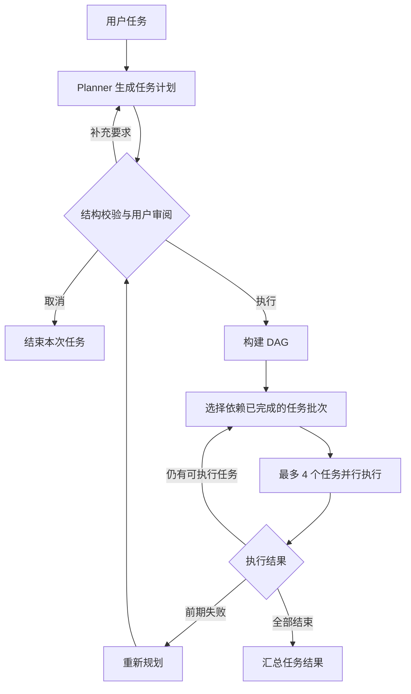

# CodeMate

CodeMate 是一个基于 Java 17 的终端 AI 编程助手，通过自然语言驱动代码阅读、文件修改、命令执行和项目创建。

当前版本：**v0.2.0 — Plan-and-Execute 与 DAG 调度**。

## 当前能力

- **ReAct 模式**：模型选择工具，程序执行并回传结果，模型继续判断下一步。
- **Plan-and-Execute 模式**：先生成完整计划，再按任务依赖逐批执行。
- **DAG 调度**：使用有向无环图表示任务依赖，同一批最多并行执行 4 个互不依赖的任务。
- **计划审阅**：执行前可确认、展开完整计划、取消，或补充要求后重新规划。
- **失败处理**：任务失败且计划进度不足一半时尝试重新规划；依赖失败任务的节点不会被错误执行。
- **基础工具**：读取文件、写入文件、列出目录、执行 Shell 命令、创建项目骨架。
- **会话历史**：保留用户消息、模型回复与工具结果，支持手动清空。

## 快速开始

需要 Java 17+、Maven 和 GLM API Key。Shell 工具依赖 PATH 中可用的 `bash`，Windows 可以使用 Git Bash 环境。

```powershell
Copy-Item .env.example .env
# 编辑 .env，填写 GLM_API_KEY
mvn clean package
java -jar target/codemate-0.2.0.jar
```

API Key 的读取顺序为：当前目录 `.env`、用户主目录 `.env`、环境变量 `GLM_API_KEY`。`.env` 已加入 Git 忽略规则。

## 使用方式

默认输入使用 ReAct：

```text
读取 pom.xml 并说明项目依赖
```

直接使用计划模式：

```text
/plan 分析项目结构，修改实现并验证结果
```

也可以先输入 `/plan`，让下一条任务使用计划模式。计划生成后：

| 按键 | 行为 |
| --- | --- |
| `Enter` | 执行当前计划 |
| `Ctrl+O` | 展开完整计划 |
| `Esc` | 折叠完整计划，或取消本次计划 |
| `I` | 输入补充要求并重新规划 |

其他命令：`/clear` 清空对话历史，`/exit` 或 `/quit` 退出。

## 执行流程



Plan 中的每个任务仍然可以多轮调用工具，单任务最多执行 5 轮。计划只负责组织任务，实际文件和命令操作仍由统一工具注册表执行。

## 代码结构

```text
src/main/java/com/codemate/
├── cli/                  终端入口、命令解析、计划审阅输入
├── agent/
│   ├── Agent.java        ReAct 执行循环
│   └── PlanExecuteAgent.java
├── plan/                 Planner、任务模型与 DAG 执行计划
├── llm/GLMClient.java    模型请求和响应解析
└── tool/ToolRegistry.java
```

技术栈：Java 17、Maven、JLine、Jackson、OkHttp、JUnit 5、SLF4J。

## 当前边界

- ReAct 与 Plan 由用户选择，尚未实现按任务复杂度自动路由。
- 重规划只在执行异常且当前进度不足 50% 时触发，不是每一步之后都进行全局判断。
- 当前模型配置固定在代码中；模型请求和单任务内部工具调用仍为串行执行。
- 文件写入和命令执行直接生效，尚未加入人工审批、沙箱和命令级超时。
- 尚未实现 Memory、RAG、Multi-Agent 和 MCP。

## 版本记录

完整演进记录和验证结果见 [CHANGELOG.md](CHANGELOG.md)。
